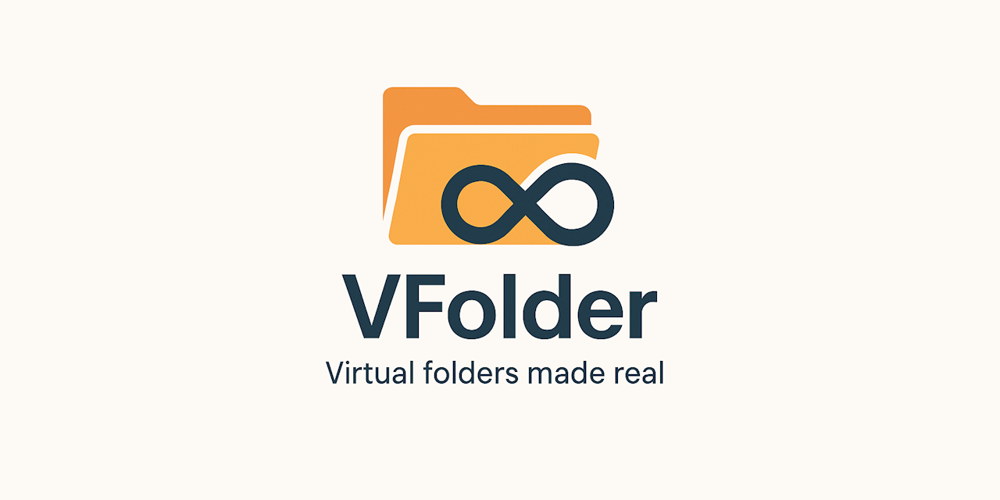

#   
[](https://discord.gg/tPWjMwK) [](https://bsky.app/profile/tinybiggames.com)  

# VFolder

**VFolder** is a lightweight, high-performance virtual file system library for Delphi. It allows you to package a folder of files into a single `.vff` archive that can be accessed at runtime just like a real filesystem.

## 🔧 Features

- 🗂 Package entire folder structures into a single `.vff` file
- 📂 Access files as if they exist on the OS filesystem (no unpacking needed)
- 📜 Supports file enumeration, extraction, and streaming
- ⚙️ Add virtual paths to process search path (great for DLLs)
- 🪃 Clean, zero-leak memory management via opaque `TVFolder` handle
- 🪄 Easy integration with existing Delphi projects
- ✅ Fully documented API with test examples

## 🧪 Example Usage

### 📦 Building a VFolder Archive

```pascal
// Basic build
vfBuild('res', 'res.vff');

// Build with progress callback
vfBuild('res', 'res.vff', BuildProgressCallback, nil);
```

### 📁 Opening and Extracting from VFolder

```pascal
var
  vf: TVFolder;
  tempPath: PWideChar;
  size: Int64;
begin
  vf := vfNew();
  try
    if vfOpen(vf, 'res.vff') then
    begin
      if vfOpenFile(vf, 'assets\logo.png', @tempPath, @size) then
        TFile.Copy(tempPath, 'logo.png', True);
    end;
  finally
    vfClose(vf);
    vfFree(vf);
  end;
end;
```

## 📌 API Highlights

| Function                     | Description                                                                 |
|-----------------------------|-----------------------------------------------------------------------------|
| `vfBuild`                   | Packages a folder into a `.vff` archive                                     |
| `vfOpen` / `vfClose`        | Opens or closes a `.vff` file                                               |
| `vfOpenFile` / `vfCloseFile`| Makes a virtual file temporarily accessible on the OS filesystem            |
| `vfFileExist`               | Checks if a virtual file exists                                            |
| `vfGetFileCount`            | Returns number of files in the archive                                     |
| `vfGetEntry`                | Retrieves name and size of file by index                                   |
| `vfSetVirtualBasePath`      | Sets the root virtual path inside the archive                              |
| `vfAddPathToProcessPath`    | Adds a virtual folder path to the process DLL search path                   |

## 🚀 Quick Start

### Requirements

- Delphi (64-bit target only)
- Windows platform

### Installation

To get started with VFolder in your Delphi project:

- **Option 1: Clone the repository**
  ```bash
  git clone https://github.com/tinyBigGAMES/VFolder.git
  ```
  This gives you full access to the latest source code, including example tests and updates.

- **Option 2: Download the latest source archive**  
  [Download ZIP](https://github.com/tinyBigGAMES/VFolder/archive/refs/heads/main.zip)

Once downloaded or cloned:
1. Add `VFolder.pas` to your Delphi project.
2. Build your application targeting Win64.
3. You're ready to use the VFolder API.
4. Refer to the examples for usage.

## 📂 Tests

Three tests are included in the source:

- **Test01** – Basic `vfBuild` test
- **Test02** – Build with live progress using `BuildProgressCallback`
- **Test03** – Opens a `.vff`, lists contents, and extracts `path1\bluestone.png` to `image.png`

---

## 🔧 BuildProgressCallback

```pascal
procedure BuildProgressCallback(const filename: PWideChar;  
  const percentage: Integer; const newFile: Boolean;  
  const userData: Pointer);
begin
  if newFile then
    WriteLn;
  Write(Format(#13'%s (%d%%)...', [filename, percentage]));
end;
```

## 📁 VFF Format

- Single-file virtual folder archive
- Extension: `.vff` (default via `vfGetDefaultFileExtension`)
- Fully self-contained and portable
- Fast indexing and file lookup

## ⚠️ Repository Status  
> 🚧 **Note:** This repository is currently in the **initial setup phase**. While full documentation is still in progress, the code is **fully functional** and considered **generally stable**.  
>  
> Comprehensive **examples, guides, and API documentation** are coming soon. Stay tuned—this README and related resources will be updated regularly! 🚀

## 💬 Support & Resources

- 🐞 **Report Issues:** [GitHub Issue Tracker](https://github.com/tinyBigGAMES/VFolder/issues)  
- 💬 **Join the Community:** [Forum](https://github.com/tinyBigGAMES/VFolder/discussions) | [Discord](https://discord.gg/tPWjMwK)  
- 📚 **Learn Delphi:** [Learn Delphi](https://learndelphi.org)  

## 🤝 Contributing

We welcome contributions to **VFolder**! 🚀  

### 💡 Ways to Contribute:
- 🐛 **Report Bugs** – Help improve `VFolder` by submitting issues.  
- ✨ **Suggest Features** – Share ideas to enhance its functionality.  
- 🔧 **Submit Pull Requests** – Improve the codebase and add features.  

### 🏆 Contributors

<a href="https://github.com/tinyBigGAMES/VFolder/graphs/contributors">
  
</a>

## 📜 License

**VFolder** is distributed under the **BSD-3-Clause License**, allowing redistribution and modification in both source and binary forms. 
See the [LICENSE](https://github.com/tinyBigGAMES/VFolder?tab=BSD-3-Clause-1-ov-file#BSD-3-Clause-1-ov-file) for details.

## 💖 Support & Sponsorship

Your support keeps **VFolder** evolving! If you find this library useful, please consider [sponsoring the project](https://github.com/sponsors/tinyBigGAMES). Every contribution helps drive future enhancements and innovations.

### Other ways to support:
- ⭐ **Star the repo** – Show your appreciation.  
- 📢 **Share with your network** – Spread the word.  
- 🐛 **Report bugs** – Help improve `VFolder`.  
- 🔧 **Submit fixes** – Contribute by fixing issues.  
- 💡 **Suggest features** – Help shape its future.  

🚀 Every contribution makes a difference – thank you for being part of the journey!  
  
---

🔥 *VFolder – Virtaul folders made real*

<p align="center">
  
</p>
<h5 align="center">Made with ❤️ in Delphi</h5>
